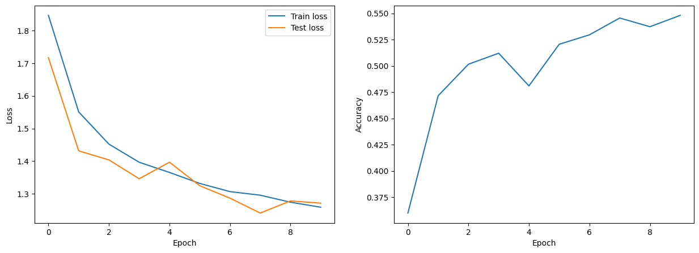
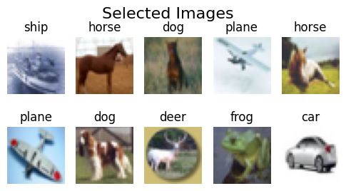
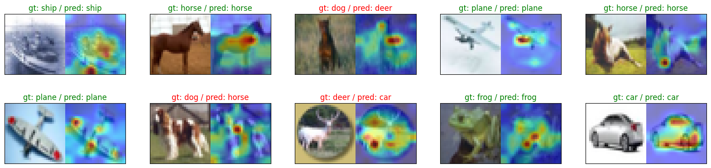

# 🚀 Vision Transformer: Analyzing AI's Attention 🚀

Welcome to the **Vision Transformer Project**! This repository explores how Vision Transformers (ViTs) process images, revealing insights into their attention mechanisms and their potential applications in image classification tasks.

---

## 📖 Overview

This project demonstrates the power of Vision Transformers, achieving **70% accuracy** on the CIFAR-10 dataset within **20 epochs**. Through **attention map visualization**, the model showcases its ability to:

- Focus on **key features**, such as aeroplane wings and animal ear shapes.
- Develop an intuitive understanding of **object boundaries** without explicit training.
- Prioritize image regions similarly to **human visual processing**.

---

## 🌟 Key Features

1. **Custom Vision Transformer Implementation**:
   - Built from scratch with attention and encoder modules.
   - Tailored for CIFAR-10 classification.

2. **Attention Map Visualization**:
   - See where the model focuses when making predictions.
   - Compare input images with output predictions and attention overlays.

3. **Performance Metrics**:
   - Visualized training and validation loss over epochs.
   - Accuracy trends to track progress.

---
## 📊 Training Performance

### Loss and Accuracy over Epochs


This plot illustrates the model's performance in terms of loss reduction and accuracy improvement across training epochs.

---


## 🖼️ Sample Visualizations

### Selected Input Images


### Input vs. Model Prediction with Attention Maps
 Ground Truth & Prediction & Attention Map 
  


---

## 🛠️ Installation and Setup

1. **Clone the repository**:
   ```bash
   git clone https://github.com/yourusername/vision-transformer.git
   cd vision-transformer
2. Create and activate a virtual environment
    ```bash
    python -m venv venv
3. Activate the virtual environment
    On Windows
    ```bash
    venv\Scripts\activate
    On macOS and Linux
    source venv/bin/activate

4. Install dependencies from requirements.txt
    ```bash
    pip install -r requirements.txt

5. Run the notebook
